# Product Roadmap

_Generated: 2026-06-25_
_Stage: early-mvp · Methodology: hybrid (RICE for feature, WSJF for enabler/tech-debt/compliance, FIFO for ops)_

> **Context:** all four items are explicitly **post-v1 follow-ups** from the architecture
> handoff (§5). The v1 build itself lives in the Kanban board (11 cards, ~23d) and is not
> part of this roadmap. This roadmap ranks the *deferred* work for after v1 ships.

## Capacity Allocation (early-mvp)

| Category | % | Notional budget (of a 10pw wave) |
|----------|--:|---------------------------------:|
| feature | 80 | 8.0 pw |
| enabler | 15 | 1.5 pw |
| tech-debt | 0 | 0.0 pw |
| compliance | 0 | 0.0 pw |
| ops | 5 | 0.5 pw |

⚑ **Stage tension:** the early-mvp capacity model zeroes **tech-debt** and **compliance**,
but the two cheapest, highest-WSJF wins here live in exactly those buckets
(IDEA-004 FR-003 negative AC, WSJF 6.0, ~1 test; IDEA-002 per-IP cap, WSJF 5.0, small).
Meanwhile the only feature (IDEA-001) is gated on a v1 **non-goal** (multiple real providers).
Capacity % is a guide, not a rule — see recommendation below.

## Wave 1

### feature  (8.0 pw budget)
1. **IDEA-001** Fallback-provider routing on ErrOpenState (RICE 13.3) — 3 pw
   ⚠ Precondition: multiple real providers (currently out of scope per vision Non-goals).
   Effectively blocked until multi-provider support is in scope.

### enabler  (1.5 pw budget)
1. **IDEA-003** Durable queue / WAL for billing-grade metering (WSJF 3.0) — 5 pw
   ⚠ Exceeds bucket (5 pw > 1.5 pw). Defer until metering is revenue-critical, or split.

### tech-debt  (0.0 pw budget)
1. **IDEA-004** FR-003 negative/boundary AC (WSJF 6.0) — ~0.2 pw
   — 0% bucket at early-mvp; **recommended as an opportunistic win** (nearly free, see below).

### compliance  (0.0 pw budget)
1. **IDEA-002** Per-IP ephemeral-key issuance cap (WSJF 5.0) — ~0.5 pw
   — 0% bucket at early-mvp; small security hardening, do when CARD-005 lands.

### ops  (0.5 pw budget)
— no items.

## All ranked ideas

| Rank | Wave | ID | Idea | Cat | Method | Score | Builds on | Status |
|------|------|----|------|-----|--------|------:|-----------|--------|
| 1 | 1 | IDEA-001 | Fallback-provider routing | feature | RICE | 13.3 | — (multi-provider) | backlog |
| 2 | 1 | IDEA-004 | FR-003 negative AC | tech-debt | WSJF | 6.0 | CARD-004 | backlog |
| 3 | 1 | IDEA-002 | Per-IP ephemeral-key cap | compliance | WSJF | 5.0 | CARD-005 | backlog |
| 4 | 1 | IDEA-003 | Durable WAL metering | enabler | WSJF | 3.0 | CARD-010 | backlog |

_(Note: scores are not comparable across methodologies; the table is ordered for overview only.
Prioritize within capacity buckets, not by raw score.)_

## Gantt (dependency order)

```mermaid
gantt
  title Post-v1 Roadmap
  dateFormat X
  axisFormat Week %W

  section feature
    Fallback routing (blocked: multi-provider) :idea001, 0, 21d

  section enabler
    Durable WAL metering :idea003, 0, 35d

  section compliance
    Per-IP issuance cap :idea002, 0, 3d

  section tech-debt
    FR-003 negative AC :idea004, 0, 1d
```

## Recommendation

These are all **post-v1**. Do **not** open architecture or kanban work for them now —
focus on the 11 v1 cards. When v1 ships:

1. **Fold the two cheap wins into the v1 cards opportunistically** (the capacity model's 0%
   buckets shouldn't block ~1 day of work): IDEA-004 (FR-003 negative AC) alongside CARD-004,
   IDEA-002 (per-IP cap) alongside CARD-005. Both are small hardening/coverage that strengthen
   the "production-readiness" and "code taste" signals.
2. **Defer IDEA-003 (durable WAL)** until metering is revenue-critical — it's a "what I'd add
   for production" item, well documented in ADR-0007.
3. **Defer IDEA-001 (fallback routing)** until multiple real providers are in scope — it's
   currently a non-goal; revisit the vision before scheduling it.

## Next step

No architect launch recommended yet — revisit after v1. Re-run `/forge:roadmap` when the
backlog grows or the stage advances (early-mvp → pre-launch shifts capacity toward
compliance/tech-debt).
